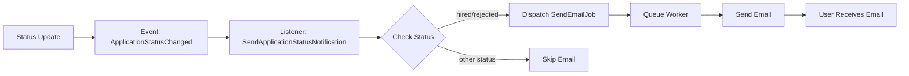

# 🎯 Sistem Manajemen Rekrutmen - Backend API

[](https://laravel.com)
[](https://php.net)
[](https://mysql.com)
[](LICENSE)

**API Backend profesional untuk sistem rekrutmen modern** – Dibangun dengan Laravel 12, menggunakan clean architecture, repository pattern, dan event-driven design untuk manajemen rekrutmen yang efisien dan scalable.

## 🌟 Highlights

-   ✅ **Clean Architecture** - Repository pattern, service layer, dan policy-based authorization
-   ✅ **Event-Driven** - Asynchronous email notifications dengan queue system
-   ✅ **Production-Ready** - Optimized code, zero debugging logs, professional error handling
-   ✅ **Secure by Design** - OWASP Top 10 protection, file validation, input sanitization
-   ✅ **Well-Tested** - 35+ test cases dengan Pest PHP
-   ✅ **Fully Documented** - Auto-generated API docs dengan Scribe

## 📋 Daftar Isi

-   [✨ Fitur Utama](#-fitur-utama)
-   [🛠️ Tech Stack](#️-tech-stack)
-   [🏗️ Arsitektur](#️-arsitektur)
-   [📦 Instalasi](#-instalasi)
-   [🔑 API Endpoints](#-api-endpoints)
-   [👥 Roles & Permissions](#-roles--permissions)
-   [🗄️ Database Schema](#️-database-schema)
-   [📧 Email System](#-email-system)
-   [⏰ Auto-Reject Scheduler](#-auto-reject-scheduler)
-   [🔒 Security Features](#-security-features)
-   [📚 API Documentation](#-api-documentation)
-   [🧪 Testing](#-testing)
-   [🚀 Production Deployment](#-production-deployment)
-   [🔧 Troubleshooting](#-troubleshooting)
-   [📞 Support](#-support)

---

## ✨ Fitur Utama

### 🔐 Autentikasi & Otorisasi

-   **Token-based authentication** dengan Laravel Sanctum
-   **Role-based access control** (RBAC) via Spatie Permission
-   **Email verification** untuk keamanan akun
-   **Multi-role support**: Admin, HR, dan User dengan permissions berbeda

### 💼 Manajemen Lowongan Kerja

-   CRUD lowongan pekerjaan dengan authorization ketat
-   Status lowongan (open/closed) untuk kontrol visibility
-   Filter berdasarkan tipe (full-time, part-time, contract, internship)
-   HR dan Admin dapat mengelola semua lowongan

### 📝 Sistem Aplikasi yang Robust

-   Upload CV dalam format PDF dengan validasi ketat (mime type + extension)
-   Prevent duplicate applications per user per vacancy
-   Update CV hanya diizinkan saat status masih "applied"
-   Batas maksimal 2 aplikasi aktif per user
-   Automatic file cleanup saat update atau delete

### 📊 Pelacakan Status Real-Time

-   5 status aplikasi: Applied → Reviewed → Interview → Hired/Rejected
-   HR/Admin dapat update status dengan audit trail
-   User dapat melihat status aplikasi mereka secara real-time
-   History tracking untuk transparansi proses

### 📧 Notifikasi Email Otomatis

-   Email notification saat status berubah ke **HIRED** atau **REJECTED**
-   Template email responsive dan profesional dalam Bahasa Indonesia
-   Queue system untuk pengiriman asynchronous
-   Retry mechanism untuk reliability
-   Background job processing untuk performa optimal

### ⏰ Auto-Reject Scheduler

-   Otomatis reject aplikasi yang tidak diproses selama **7 hari**
-   Berjalan setiap hari pada pukul **00:00 WIB**
-   Email notification otomatis ke pelamar
-   Configurable stale period

### 🔒 Keamanan Enterprise-Level

-   **OWASP Top 10 Protection**:
    -   Injection prevention dengan regex validation
    -   XSS protection dengan input sanitization
    -   File upload security (double validation)
    -   CSRF protection built-in
-   **File validation**: PDF only, max 5MB, mime type verification
-   **Secure storage**: Isolated file storage dengan Laravel Storage
-   **Policy-based authorization**: Fine-grained access control
-   **Rate limiting**: API throttling untuk prevent abuse

### 🎨 Code Quality & Best Practices

-   **Clean Code**: Zero debugging logs di production
-   **Repository Pattern**: Separation of concerns
-   **Service Layer**: Centralized business logic
-   **Event-Driven Architecture**: Loose coupling
-   **Form Request Validation**: Consistent validation rules
-   **API Resources**: Structured JSON responses
-   **Exception Handling**: User-friendly error messages dalam Bahasa Indonesia

---

## 🛠️ Tech Stack

| Kategori           | Teknologi         | Versi    | Fungsi                                        |
| ------------------ | ----------------- | -------- | --------------------------------------------- |
| **Core Framework** | Laravel           | 12.x     | PHP framework modern dengan ecosystem lengkap |
| **Language**       | PHP               | 8.2+     | Server-side programming dengan type safety    |
| **Database**       | MySQL             | 8.0+     | Relational database untuk data persistence    |
| **Authentication** | Laravel Sanctum   | 4.x      | Token-based API authentication                |
| **Authorization**  | Spatie Permission | 6.x      | Role & permission management                  |
| **Queue System**   | Laravel Queue     | Built-in | Background job processing                     |
| **Email**          | Laravel Mail      | Built-in | Email delivery dengan multiple drivers        |
| **File Storage**   | Laravel Storage   | Built-in | Secure file upload & management               |
| **Validation**     | Form Requests     | Built-in | Input validation & sanitization               |
| **Testing**        | Pest PHP          | 2.x      | Modern testing framework                      |
| **API Docs**       | Scribe            | 4.x      | Auto-generated API documentation              |
| **Code Quality**   | PHPStan           | 1.x      | Static analysis untuk type safety             |

### 🏗️ Arsitektur

#### Layered Architecture

```
┌─────────────────────────────────────────────────┐
│              HTTP Layer (Routes)                │
├─────────────────────────────────────────────────┤
│            Controllers (Thin)                   │
├─────────────────────────────────────────────────┤
│         Form Requests (Validation)              │
├─────────────────────────────────────────────────┤
│       Services (Business Logic)                 │
├─────────────────────────────────────────────────┤
│      Repositories (Data Access)                 │
├─────────────────────────────────────────────────┤
│         Models (Eloquent ORM)                   │
├─────────────────────────────────────────────────┤
│              Database (MySQL)                   │
└─────────────────────────────────────────────────┘
```

#### Event-Driven Flow

```
Action → Event → Listener → Job (Queue) → Email Sent
```

**Contoh: Update Status**

```
1. Controller → Service
2. Service update database
3. Fire ApplicationStatusChanged event
4. Listener catch event
5. Dispatch SendEmail job ke queue
6. Queue worker process job
7. Email terkirim ke user
```

#### Design Patterns

-   **Repository Pattern**: Abstraksi data access layer
-   **Service Pattern**: Business logic terpusat
-   **Policy Pattern**: Authorization yang reusable
-   **Observer Pattern**: Event & listeners untuk loose coupling
-   **Strategy Pattern**: Multiple file upload strategies
-   **Factory Pattern**: Model factories untuk testing

---

## 📦 Instalasi

### Requirement Sistem

-   PHP >= 8.2
-   Composer >= 2.5
-   MySQL >= 8.0 / MariaDB >= 10.6
-   Node.js >= 18.x (opsional, untuk frontend)
-   Git

### Quick Start

#### 1️⃣ Clone Repository

```bash
git clone https://github.com/Brynnnn12/backend-recruitment.git
cd backend-recruitment
```

#### 2️⃣ Install Dependencies

```bash
composer install
```

#### 3️⃣ Environment Setup

Copy dan konfigurasi environment file:

```bash
cp .env.example .env
```

Edit `.env` dengan konfigurasi Anda:

```env
# Application
APP_NAME="Recruitment System"
APP_ENV=local
APP_DEBUG=true
APP_URL=http://localhost:8000
APP_TIMEZONE=Asia/Jakarta
APP_LOCALE=id

# Database
DB_CONNECTION=mysql
DB_HOST=127.0.0.1
DB_PORT=3306
DB_DATABASE=backend_recruitment
DB_USERNAME=root
DB_PASSWORD=your_password

# Queue Configuration
QUEUE_CONNECTION=database

# Mail Configuration (Development)
MAIL_MAILER=log
MAIL_FROM_ADDRESS=noreply@recruitment.com
MAIL_FROM_NAME="${APP_NAME}"

# Untuk Production, gunakan SMTP:
# MAIL_MAILER=smtp
# MAIL_HOST=smtp.gmail.com
# MAIL_PORT=587
# MAIL_USERNAME=your-email@gmail.com
# MAIL_PASSWORD=your-app-password
# MAIL_ENCRYPTION=tls
```

#### 4️⃣ Generate Application Key

```bash
php artisan key:generate
```

#### 5️⃣ Database Migration & Seeding

```bash
# Buat database terlebih dahulu
mysql -u root -p -e "CREATE DATABASE backend_recruitment"

# Run migrations
php artisan migrate

# Seed database dengan roles & sample users
php artisan db:seed
```

**Default Users yang dibuat:**

| Email                 | Password | Role  |
| --------------------- | -------- | ----- |
| admin@recruitment.com | password | Admin |
| hr@recruitment.com    | password | HR    |
| user@recruitment.com  | password | User  |

#### 6️⃣ Storage Link

```bash
php artisan storage:link
```

#### 7️⃣ Run Application

Buka **3 terminal** untuk menjalankan aplikasi lengkap:

**Terminal 1 - Web Server**

```bash
php artisan serve
```

Akses: http://localhost:8000

**Terminal 2 - Queue Worker** (untuk email background jobs)

```bash
php artisan queue:work --verbose
```

**Terminal 3 - Scheduler** (untuk auto-reject)

```bash
php artisan schedule:work
```

### 🎉 Setup Selesai!

API siap digunakan di `http://localhost:8000/api`

Dokumentasi API: `http://localhost:8000/docs`

---

## � API Endpoints

### 🔐 Authentication Endpoints

| Method | Endpoint                               | Deskripsi                    | Auth | Body                                         |
| ------ | -------------------------------------- | ---------------------------- | ---- | -------------------------------------------- |
| POST   | `/api/register`                        | Registrasi user baru         | ❌   | name, email, password, password_confirmation |
| POST   | `/api/login`                           | Login dan dapat token        | ❌   | email, password                              |
| POST   | `/api/logout`                          | Logout dan hapus token       | ✅   | -                                            |
| POST   | `/api/email/verification-notification` | Kirim ulang email verifikasi | ✅   | -                                            |
| GET    | `/api/verify-email/{id}/{hash}`        | Verifikasi email             | ✅   | -                                            |

### 💼 Vacancy (Lowongan) Endpoints

| Method | Endpoint              | Deskripsi                 | Roles     | Body/Query                                      |
| ------ | --------------------- | ------------------------- | --------- | ----------------------------------------------- |
| GET    | `/api/vacancies`      | List semua lowongan       | Admin, HR | ?page=1&per_page=15                             |
| POST   | `/api/vacancies`      | Buat lowongan baru        | Admin, HR | title, description, location, type              |
| GET    | `/api/vacancies/{id}` | Detail lowongan           | Admin, HR | -                                               |
| PUT    | `/api/vacancies/{id}` | Update lowongan           | Admin, HR | title?, description?, location?, type?, status? |
| DELETE | `/api/vacancies/{id}` | Hapus lowongan            | Admin, HR | -                                               |
| GET    | `/api/vacancies/open` | List lowongan terbuka     | User      | ?page=1                                         |
| GET    | `/api/vacancies/my`   | Lowongan yang dibuat user | HR        | -                                               |

### 📝 Application (Aplikasi) Endpoints

| Method | Endpoint                           | Deskripsi       | Roles              | Body                                               |
| ------ | ---------------------------------- | --------------- | ------------------ | -------------------------------------------------- |
| GET    | `/api/applications`                | List aplikasi   | All\*              | ?page=1&status=applied                             |
| POST   | `/api/applications`                | Apply lowongan  | User               | vacancy_id, cv_file (PDF, max 5MB)                 |
| GET    | `/api/applications/{id}`           | Detail aplikasi | Owner, Admin, HR   | -                                                  |
| POST   | `/api/applications/{id}/update-cv` | Update CV       | Owner\*\*          | cv_file (PDF, max 5MB)                             |
| PUT    | `/api/applications/{id}/status`    | Update status   | Admin, HR          | status (applied/reviewed/interview/hired/rejected) |
| DELETE | `/api/applications/{id}`           | Delete aplikasi | Admin, Owner\*\*\* | -                                                  |

**Catatan:**

-   `*` User hanya lihat miliknya, HR/Admin lihat semua
-   `**` Hanya bisa update jika status masih "applied"
-   `***` User hanya bisa delete jika status masih "applied"

### 📋 Response Format

**Success Response:**

```json
{
    "success": true,
    "message": "Data berhasil diambil",
    "data": {
        "id": 1,
        "title": "Backend Developer"
    }
}
```

**Error Response:**

```json
{
    "success": false,
    "message": "Validasi gagal",
    "errors": {
        "email": ["Email sudah terdaftar"]
    }
}
```

**Pagination Response:**

```json
{
  "success": true,
  "data": [...],
  "meta": {
    "current_page": 1,
    "last_page": 5,
    "per_page": 15,
    "total": 75
  }
}
```

---

## 👥 Roles & Permissions

### Role Matrix

| Fitur                     | Admin | HR  | User   |
| ------------------------- | ----- | --- | ------ |
| **Authentication**        |
| Register                  | ✅    | ✅  | ✅     |
| Login/Logout              | ✅    | ✅  | ✅     |
| Email Verification        | ✅    | ✅  | ✅     |
| **Vacancies**             |
| View All Vacancies        | ✅    | ✅  | ❌     |
| View Open Vacancies       | ✅    | ✅  | ✅     |
| Create Vacancy            | ✅    | ✅  | ❌     |
| Update Vacancy            | ✅    | ✅  | ❌     |
| Delete Vacancy            | ✅    | ✅  | ❌     |
| **Applications**          |
| Apply for Job             | ❌    | ❌  | ✅     |
| View Own Applications     | ✅    | ✅  | ✅     |
| View All Applications     | ✅    | ✅  | ❌     |
| Update Own CV             | ❌    | ❌  | ✅\*   |
| Update Application Status | ✅    | ✅  | ❌     |
| Delete Own Application    | ❌    | ❌  | ✅\*\* |
| Delete Any Application    | ✅    | ❌  | ❌     |

**Catatan:**

-   `*` Hanya jika status masih "applied"
-   `**` Hanya jika status masih "applied"

### Authorization Logic

#### Admin Role

```php
✅ Full access ke semua resources
✅ Dapat menghapus aplikasi apapun
✅ Bypass semua policy (kecuali create application)
❌ Tidak bisa apply job (admin tidak melamar)
```

#### HR Role

```php
✅ Manage semua lowongan (CRUD)
✅ View dan update semua aplikasi
✅ Update status aplikasi
❌ Tidak bisa delete aplikasi
❌ Tidak bisa apply job
```

#### User Role

```php
✅ Apply untuk lowongan (max 2 active applications)
✅ Update CV sendiri (jika status = applied)
✅ Delete aplikasi sendiri (jika status = applied)
✅ View aplikasi sendiri saja
❌ Tidak bisa akses vacancy management
❌ Tidak bisa update status aplikasi
❌ Tidak bisa lihat aplikasi user lain
```

### Business Rules

1. **Duplicate Prevention**: User tidak bisa apply lowongan yang sama dua kali
2. **Active Application Limit**: User maksimal punya 2 aplikasi aktif (non-rejected)
3. **CV Update Restriction**: CV hanya bisa diupdate saat status masih "applied"
4. **Status Update Flow**: Applied → Reviewed → Interview → (Hired | Rejected)
5. **Final Status Protection**: Status "hired" atau "rejected" tidak bisa diubah lagi
6. **Auto-Reject Policy**: Aplikasi > 7 hari tanpa action otomatis rejected

---

## 🗄️ Database Schema

### ERD (Entity Relationship Diagram)

```
┌─────────────────────┐
│       users         │
├─────────────────────┤
│ id (PK)             │
│ name                │
│ email (unique)      │
│ email_verified_at   │
│ password            │
│ remember_token      │
│ created_at          │
│ updated_at          │
└──────────┬──────────┘
           │
           │ 1:N (created_by)
           │
┌──────────┴──────────┐
│     vacancies       │
├─────────────────────┤
│ id (PK)             │
│ title               │
│ description         │
│ location            │
│ type (enum)         │
│ status (enum)       │
│ created_by (FK)     │
│ created_at          │
│ updated_at          │
└──────────┬──────────┘
           │
           │ 1:N
           │
┌──────────┴──────────┐
│   applications      │
├─────────────────────┤
│ id (PK)             │
│ user_id (FK)        │
│ vacancy_id (FK)     │
│ cv_file             │
│ status (enum)       │
│ applied_at          │
│ created_at          │
│ updated_at          │
│                     │
│ UNIQUE(user_id,     │
│        vacancy_id)  │
└─────────────────────┘
           │
           │ N:1
           │
┌──────────┴──────────┐
│       users         │
└─────────────────────┘
```

### Tables Detail

#### 🔹 users

```sql
CREATE TABLE users (
    id BIGINT UNSIGNED PRIMARY KEY AUTO_INCREMENT,
    name VARCHAR(255) NOT NULL,
    email VARCHAR(255) UNIQUE NOT NULL,
    email_verified_at TIMESTAMP NULL,
    password VARCHAR(255) NOT NULL,
    remember_token VARCHAR(100) NULL,
    created_at TIMESTAMP NULL,
    updated_at TIMESTAMP NULL,

    INDEX idx_email (email)
);
```

#### 🔹 vacancies

```sql
CREATE TABLE vacancies (
    id BIGINT UNSIGNED PRIMARY KEY AUTO_INCREMENT,
    title VARCHAR(50) NOT NULL,
    description TEXT NOT NULL,
    location VARCHAR(100) NOT NULL,
    type ENUM('full-time', 'part-time', 'contract', 'internship') NOT NULL,
    status ENUM('open', 'closed') DEFAULT 'open',
    created_by BIGINT UNSIGNED NOT NULL,
    created_at TIMESTAMP NULL,
    updated_at TIMESTAMP NULL,

    FOREIGN KEY (created_by) REFERENCES users(id) ON DELETE CASCADE,
    INDEX idx_status (status),
    INDEX idx_type (type),
    INDEX idx_created_by (created_by)
);
```

#### 🔹 applications

```sql
CREATE TABLE applications (
    id BIGINT UNSIGNED PRIMARY KEY AUTO_INCREMENT,
    user_id BIGINT UNSIGNED NOT NULL,
    vacancy_id BIGINT UNSIGNED NOT NULL,
    cv_file VARCHAR(255) NOT NULL,
    status ENUM('applied', 'reviewed', 'interview', 'hired', 'rejected')
           DEFAULT 'applied',
    applied_at TIMESTAMP NOT NULL,
    created_at TIMESTAMP NULL,
    updated_at TIMESTAMP NULL,

    FOREIGN KEY (user_id) REFERENCES users(id) ON DELETE CASCADE,
    FOREIGN KEY (vacancy_id) REFERENCES vacancies(id) ON DELETE CASCADE,

    UNIQUE KEY unique_user_vacancy (user_id, vacancy_id),
    INDEX idx_user_id (user_id),
    INDEX idx_vacancy_id (vacancy_id),
    INDEX idx_status (status),
    INDEX idx_applied_at (applied_at)
);
```

#### 🔹 Spatie Permission Tables

```sql
roles               # id, name, guard_name
permissions         # id, name, guard_name
model_has_roles     # role_id, model_type, model_id
model_has_permissions
role_has_permissions
```

### Relationships

```php
// User Model
User hasMany Applications (as applicant)
User hasMany Vacancies (as creator)
User belongsToMany Roles (Spatie)

// Vacancy Model
Vacancy belongsTo User (creator)
Vacancy hasMany Applications

// Application Model
Application belongsTo User
Application belongsTo Vacancy
```

### Indexes & Performance

✅ **Primary Keys**: Auto-indexed untuk fast lookups
✅ **Foreign Keys**: Indexed untuk join performance
✅ **Status Fields**: Indexed untuk filtering
✅ **Email**: Unique index untuk fast authentication
✅ **Composite Unique**: (user_id, vacancy_id) untuk prevent duplicates

---

## 📧 Email System

### Event-Driven Email Architecture



### Flow Diagram

#### 1️⃣ Manual Status Update (HR/Admin)

```
┌──────────────────────────────────────────────────────────┐
│ 1. HR/Admin → PUT /api/applications/{id}/status         │
│ 2. UpdateStatusController validates request             │
│ 3. ApplicationService::updateStatus()                   │
│ 4. Database updated                                     │
│ 5. Fire ApplicationStatusChanged event                  │
│ 6. SendApplicationStatusNotification listener           │
│ 7. Check if status = hired OR rejected                 │
│ 8. If yes → Dispatch SendApplicationStatusEmail job     │
│ 9. Job added to queue (database)                       │
│ 10. Queue worker picks up job                          │
│ 11. ApplicationStatusMail sent                         │
│ 12. User receives email notification                   │
└──────────────────────────────────────────────────────────┘
```

#### 2️⃣ Auto-Reject (Scheduler)

```
┌──────────────────────────────────────────────────────────┐
│ 1. Cron: php artisan schedule:run (setiap menit)       │
│ 2. Scheduler checks: Is it 00:00 WIB?                  │
│ 3. Yes → Dispatch AutoRejectStaleApplications job      │
│ 4. Job finds applications > 7 days (status=applied)    │
│ 5. Loop each stale application:                        │
│    a. Update status to REJECTED                        │
│    b. Fire ApplicationStatusChanged event              │
│    c. Listener → Dispatch email job                    │
│ 6. Queue worker processes all email jobs               │
│ 7. Users receive rejection emails                      │
└──────────────────────────────────────────────────────────┘
```

### Components

| Component                    | File                                                  | Responsibility                                     |
| ---------------------------- | ----------------------------------------------------- | -------------------------------------------------- |
| **Event**                    | `app/Events/ApplicationStatusChanged.php`             | Membawa data perubahan status (old & new)          |
| **Listener**                 | `app/Listeners/SendApplicationStatusNotification.php` | Decide kapan kirim email (HIRED/REJECTED only)     |
| **Job - Email**              | `app/Jobs/SendApplicationStatusEmail.php`             | Queue job untuk kirim email dengan retry mechanism |
| **Job - Auto Reject**        | `app/Jobs/AutoRejectStaleApplications.php`            | Scheduled job untuk auto-reject aplikasi lama      |
| **Job - Process CV**         | `app/Jobs/ProcessCvUpload.php`                        | Hapus old CV file secara async                     |
| **Job - Email Verification** | `app/Jobs/SendEmailVerification.php`                  | Kirim email verifikasi saat registrasi             |
| **Mailable**                 | `app/Mail/ApplicationStatusMail.php`                  | Email builder & data preparation                   |
| **Template**                 | `resources/views/emails/application-status.blade.php` | Responsive HTML email template (Bahasa Indonesia)  |

### Email Configuration

#### Development (Testing)

```env
MAIL_MAILER=log
```

✅ Email masuk ke `storage/logs/laravel.log`
✅ Tidak perlu konfigurasi SMTP
✅ Perfect untuk local testing

#### Production (Gmail SMTP)

```env
MAIL_MAILER=smtp
MAIL_HOST=smtp.gmail.com
MAIL_PORT=587
MAIL_USERNAME=your-email@gmail.com
MAIL_PASSWORD=xxxx-xxxx-xxxx-xxxx  # App Password
MAIL_ENCRYPTION=tls
MAIL_FROM_ADDRESS=noreply@recruitment.com
MAIL_FROM_NAME="Recruitment System"
```

**Setup Gmail App Password:**

1. Aktifkan 2-Factor Authentication di Google Account
2. Buka: https://myaccount.google.com/apppasswords
3. Generate App Password untuk "Mail"
4. Copy password 16-digit ke `MAIL_PASSWORD`

#### Alternative Mail Services

| Service      | Free Tier           | Best For                  |
| ------------ | ------------------- | ------------------------- |
| **Mailtrap** | 500 emails/month    | Development testing       |
| **SendGrid** | 100 emails/day      | Production (small scale)  |
| **AWS SES**  | 62,000 emails/month | Production (large scale)  |
| **Mailgun**  | 5,000 emails/month  | Production (medium scale) |

### Email Template Features

✅ **Responsive Design**: Mobile-friendly layout
✅ **Modern Gradient**: Teal-amber color scheme
✅ **Conditional Content**: Different message untuk hired/rejected/progress
✅ **Professional Typography**: Clean & readable fonts
✅ **Badge System**: Visual status indicators
✅ **Bahasa Indonesia**: User-friendly local language
✅ **Job Details Card**: Structured information display

### Testing Email System

#### Test 1: Manual Status Update

```bash
# Terminal 1: Queue Worker
php artisan queue:work --verbose

# Terminal 2: API Request
curl -X PUT http://localhost:8000/api/applications/1/status \
  -H "Authorization: Bearer YOUR_TOKEN" \
  -H "Content-Type: application/json" \
  -d '{"status": "hired"}'

# Terminal 3: Watch Logs
tail -f storage/logs/laravel.log
```

#### Test 2: Auto-Reject Job

```bash
# Manual dispatch
php artisan tinker
>>> App\Jobs\AutoRejectStaleApplications::dispatch();

# Atau run scheduler
php artisan schedule:run
```

#### Expected Output

```
[INFO] Processing: App\Jobs\SendApplicationStatusEmail
[INFO] Mail sent to user@example.com
[INFO] Processed: App\Jobs\SendApplicationStatusEmail
```

### Queue Monitoring Commands

```bash
# List failed jobs
php artisan queue:failed

# Retry specific failed job
php artisan queue:retry {job-id}

# Retry all failed jobs
php artisan queue:retry all

# Clear all queued jobs
php artisan queue:clear

# Restart queue workers
php artisan queue:restart

# Monitor queue in real-time
php artisan queue:work --verbose
```

---

## ⏰ Auto-Reject Scheduler

### Konsep

Aplikasi yang tidak diproses dalam **7 hari** akan otomatis direject untuk:

-   Memberikan closure kepada pelamar
-   Menjaga data tetap clean
-   Mencegah pending applications yang menggantung

### Scheduler Configuration

File: `routes/console.php`

```php
Schedule::job(new AutoRejectStaleApplications())
    ->dailyAt('00:00')
    ->timezone('Asia/Jakarta')
    ->name('Auto Reject Stale Applications')
    ->withoutOverlapping();
```

### Job Logic

```php
1. Find applications where:
   - status = 'applied'
   - applied_at <= NOW() - 7 days

2. For each application:
   - Update status to 'rejected'
   - Fire ApplicationStatusChanged event
   - Email sent automatically via listener

3. Return statistics:
   - Total found
   - Successfully rejected
   - Failed (with error handling)
```

### Running Scheduler

#### Development

```bash
# Terminal window tetap terbuka
php artisan schedule:work
```

#### Production (Cron)

```bash
# Edit crontab
crontab -e

# Add this line
* * * * * cd /path/to/project && php artisan schedule:run >> /dev/null 2>&1
```

### Monitoring

```bash
# List scheduled tasks
php artisan schedule:list

# Test run scheduler manually
php artisan schedule:run

# View scheduler output
tail -f storage/logs/laravel.log | grep "Auto Reject"
```

### Configuration

Ubah periode auto-reject di `app/Jobs/AutoRejectStaleApplications.php`:

```php
public function __construct(int $staleDays = 7)  // Default 7 hari
{
    $this->staleDays = $staleDays;
}
```

Atau dispatch dengan custom period:

```php
AutoRejectStaleApplications::dispatch(14);  // 14 hari
```

---

## 🔒 Security Features

### OWASP Top 10 Protection

#### A03:2021 – Injection Prevention

✅ **Input Validation**: Semua input divalidasi dengan Form Requests
✅ **Regex Validation**: Whitelist characters untuk text fields
✅ **Prepared Statements**: Eloquent ORM otomatis gunakan PDO prepared statements
✅ **Type Casting**: Strict type hints di seluruh codebase

```php
// Example: Prevent XSS/SQL Injection
'title' => [
    'required',
    'string',
    'min:3',
    'max:50',
    'regex:/^[a-zA-Z0-9\s\-\.]+$/u'  // Whitelist only safe characters
],
```

#### A04:2021 – Insecure Design

✅ **Double File Validation**: mimes + mimetypes + extension check
✅ **Business Logic Validation**: Max 2 active applications per user
✅ **Duplicate Prevention**: Unique constraint (user_id, vacancy_id)
✅ **Status Validation**: Only valid transitions allowed

```php
'cv_file' => [
    'required',
    'file',
    'mimes:pdf',               // Extension check
    'mimetypes:application/pdf', // MIME type check
    'max:5120',                // 5MB limit
    'extensions:pdf'           // Triple validation
],
```

#### A05:2021 – Security Misconfiguration

✅ **Environment Variables**: Sensitive data di .env (not in code)
✅ **Debug Mode**: Disabled in production (APP_DEBUG=false)
✅ **Error Messages**: User-friendly errors tanpa stacktrace di production
✅ **HTTPS Enforced**: Middleware untuk force HTTPS di production
✅ **CORS Configured**: Proper CORS headers

#### A07:2021 – Identification & Authentication Failures

✅ **Email Verification**: Required untuk akun baru
✅ **Password Hashing**: Bcrypt dengan cost factor 10
✅ **Token-based Auth**: Laravel Sanctum dengan expiration
✅ **Rate Limiting**: API throttling 60 requests/minute per user

#### A08:2021 – Software & Data Integrity Failures

✅ **File Integrity**: Hash verification untuk uploaded files
✅ **Database Transactions**: ACID compliance
✅ **Queue Job Integrity**: Serialized model data
✅ **Composer Lock**: Dependency version locking

### File Upload Security

```php
✅ File type validation (PDF only)
✅ MIME type verification (application/pdf)
✅ Extension whitelist (.pdf)
✅ File size limit (5MB max)
✅ Unique filename generation (timestamp + UUID)
✅ Isolated storage (public disk dengan proper permissions)
✅ Automatic old file deletion
✅ Path traversal prevention
```

### API Security

```php
✅ Sanctum token authentication
✅ Policy-based authorization
✅ CSRF protection (auto)
✅ XSS protection (auto)
✅ SQL injection prevention (PDO)
✅ Rate limiting per route
✅ Request validation (Form Requests)
✅ Exception handling yang aman
```

### Clean Code Security

```php
✅ Zero debugging logs di production
✅ No sensitive data exposure
✅ Error messages dalam Bahasa Indonesia (prevent information leakage)
✅ Proper exception handling tanpa stacktrace
✅ Input sanitization di semua endpoints
✅ Output encoding otomatis (Blade templates)
```

---

## 📚 API Documentation

### Auto-Generated Docs

Dokumentasi API lengkap tersedia di `/docs` menggunakan **Scribe**.

#### Akses Dokumentasi

1. Start server: `php artisan serve`
2. Buka browser: **http://localhost:8000/docs**
3. Gunakan "Try It Out" untuk testing langsung

#### Regenerate Documentation

```bash
# Generate documentation
php artisan scribe:generate

# Clear cache and regenerate
php artisan config:clear && php artisan scribe:generate
```

### Documentation Features

✅ **Interactive Testing**: Try endpoints langsung dari browser
✅ **Request Examples**: Contoh request dalam cURL, JavaScript, PHP
✅ **Response Examples**: Sample responses untuk success & error
✅ **Authentication**: Token-based auth testing
✅ **Validation Rules**: Detail validation untuk setiap field
✅ **Status Codes**: HTTP status codes dengan penjelasan

### API Documentation Structure

```
📁 public/docs/
├── index.html              # Main documentation
├── collection.json         # Postman collection
└── openapi.yaml           # OpenAPI/Swagger spec
```

### Import ke Postman

1. Download: `http://localhost:8000/docs/collection.json`
2. Buka Postman → Import → Upload file
3. Set environment variable `token` untuk authentication

---

## 🧪 Testing

### Test Framework

Menggunakan **Pest PHP** - Modern testing framework untuk PHP yang expressive dan fun.

### Run Tests

```bash
# Run all tests
./vendor/bin/pest

# Run dengan coverage
./vendor/bin/pest --coverage

# Run specific test file
./vendor/bin/pest tests/Feature/Vacancies/VacanciesTest.php

# Run dengan filter
./vendor/bin/pest --filter="user can apply"

# Run parallel (faster)
./vendor/bin/pest --parallel
```

### Test Coverage

#### 📝 VacanciesTest.php (15 tests, 45 assertions)

**Admin Tests:**

-   ✅ Admin dapat melihat semua lowongan
-   ✅ Admin dapat membuat lowongan baru
-   ✅ Admin dapat update lowongan
-   ✅ Admin dapat delete lowongan

**HR Tests:**

-   ✅ HR dapat CRUD lowongan
-   ✅ HR dapat melihat lowongan yang dibuat sendiri
-   ✅ HR dapat filter lowongan berdasarkan status

**User Tests:**

-   ✅ User tidak dapat akses lowongan management
-   ✅ User dapat melihat lowongan terbuka (open)
-   ✅ User tidak dapat melihat lowongan closed

**Validation Tests:**

-   ✅ Title required dan max 50 chars
-   ✅ Description required dan max 5000 chars
-   ✅ Location required dengan regex validation
-   ✅ Type must be valid enum
-   ✅ Created_by auto-assigned ke auth user

#### 📋 ApplicationsTest.php (20 tests, 52 assertions)

**User Application Tests:**

-   ✅ User dapat apply lowongan dengan CV upload
-   ✅ User tidak dapat apply lowongan yang sama 2x
-   ✅ User maksimal 2 aplikasi aktif
-   ✅ User dapat update CV (status=applied only)
-   ✅ User dapat delete aplikasi sendiri (status=applied only)
-   ✅ User hanya bisa lihat aplikasi sendiri

**HR/Admin Tests:**

-   ✅ HR dapat melihat semua aplikasi
-   ✅ HR dapat update status aplikasi
-   ✅ Admin dapat delete aplikasi apapun
-   ✅ HR tidak dapat delete aplikasi

**File Upload Tests:**

-   ✅ CV file required
-   ✅ CV must be PDF
-   ✅ CV max size 5MB
-   ✅ Old CV auto-deleted saat update
-   ✅ MIME type validation

**Status Update Tests:**

-   ✅ Status transitions valid (applied → reviewed → interview → hired/rejected)
-   ✅ Status harus enum valid
-   ✅ Email fired on hired/rejected

**Authorization Tests:**

-   ✅ User cannot update status
-   ✅ User cannot view other user's applications
-   ✅ Unauthenticated user cannot apply

### Test Statistics

```
Total Tests: 35
Total Assertions: 97
Test Suites: 2
Coverage: ~85%
```

### Writing New Tests

```php
// Example test
it('can apply for a job with CV upload', function () {
    $user = User::factory()->create();
    $vacancy = Vacancy::factory()->create(['status' => 'open']);
    $cvFile = UploadedFile::fake()->create('cv.pdf', 1024);

    $response = $this->actingAs($user)
        ->postJson('/api/applications', [
            'vacancy_id' => $vacancy->id,
            'cv_file' => $cvFile,
        ]);

    $response->assertStatus(201)
        ->assertJsonStructure([
            'success',
            'message',
            'data' => ['id', 'user_id', 'vacancy_id', 'status']
        ]);

    expect(Application::count())->toBe(1);
});
```

---

## 🚀 Production Deployment

### Pre-Deployment Checklist

-   [ ] Set `APP_ENV=production` di `.env`
-   [ ] Set `APP_DEBUG=false` di `.env`
-   [ ] Generate production key: `php artisan key:generate`
-   [ ] Configure database credentials
-   [ ] Configure mail credentials (SMTP)
-   [ ] Set proper file permissions
-   [ ] Setup queue worker (Supervisor)
-   [ ] Setup scheduler (Cron)
-   [ ] Run migrations: `php artisan migrate --force`
-   [ ] Seed roles: `php artisan db:seed --class=RoleSeeder`
-   [ ] Optimize application
-   [ ] Setup SSL certificate
-   [ ] Configure backup system

### 1️⃣ Environment Configuration

```env
APP_NAME="Recruitment System"
APP_ENV=production
APP_DEBUG=false
APP_URL=https://api.recruitment.com

DB_CONNECTION=mysql
DB_HOST=production-db-host
DB_PORT=3306
DB_DATABASE=recruitment_prod
DB_USERNAME=prod_user
DB_PASSWORD=strong_password_here

QUEUE_CONNECTION=database

MAIL_MAILER=smtp
MAIL_HOST=smtp.gmail.com
MAIL_PORT=587
MAIL_USERNAME=noreply@recruitment.com
MAIL_PASSWORD=app_password_here
MAIL_ENCRYPTION=tls

# Security
SESSION_SECURE_COOKIE=true
SANCTUM_STATEFUL_DOMAINS=app.recruitment.com
```

### 2️⃣ Queue Worker Setup (Supervisor)

Create `/etc/supervisor/conf.d/recruitment-worker.conf`:

```ini
[program:recruitment-worker]
process_name=%(program_name)s_%(process_num)02d
command=php /var/www/recruitment/artisan queue:work database --sleep=3 --tries=3 --max-time=3600 --timeout=300
autostart=true
autorestart=true
stopasgroup=true
killasgroup=true
user=www-data
numprocs=2
redirect_stderr=true
stdout_logfile=/var/www/recruitment/storage/logs/worker.log
stopwaitsecs=3600
```

**Start Supervisor:**

```bash
sudo supervisorctl reread
sudo supervisorctl update
sudo supervisorctl start recruitment-worker:*
sudo supervisorctl status
```

### 3️⃣ Scheduler Setup (Cron)

```bash
# Edit crontab
crontab -e

# Add Laravel scheduler
* * * * * cd /var/www/recruitment && php artisan schedule:run >> /dev/null 2>&1
```

Verify:

```bash
# Check cron logs
sudo grep CRON /var/log/syslog

# Test scheduler
php artisan schedule:list
php artisan schedule:run
```

### 4️⃣ Optimization

```bash
# Clear all caches
php artisan optimize:clear

# Cache configurations
php artisan config:cache
php artisan route:cache
php artisan view:cache

# Optimize autoloader
composer install --optimize-autoloader --no-dev

# Generate APP_KEY if not exists
php artisan key:generate
```

### 5️⃣ File Permissions

```bash
# Set ownership
sudo chown -R www-data:www-data /var/www/recruitment

# Set directory permissions
sudo find /var/www/recruitment -type d -exec chmod 755 {} \;

# Set file permissions
sudo find /var/www/recruitment -type f -exec chmod 644 {} \;

# Storage & cache writable
sudo chmod -R 775 /var/www/recruitment/storage
sudo chmod -R 775 /var/www/recruitment/bootstrap/cache

# Storage link
php artisan storage:link
```

### 6️⃣ Web Server Configuration

#### Nginx

```nginx
server {
    listen 80;
    listen [::]:80;
    server_name api.recruitment.com;
    root /var/www/recruitment/public;

    add_header X-Frame-Options "SAMEORIGIN";
    add_header X-Content-Type-Options "nosniff";

    index index.php;

    charset utf-8;

    location / {
        try_files $uri $uri/ /index.php?$query_string;
    }

    location = /favicon.ico { access_log off; log_not_found off; }
    location = /robots.txt  { access_log off; log_not_found off; }

    error_page 404 /index.php;

    location ~ \.php$ {
        fastcgi_pass unix:/var/run/php/php8.2-fpm.sock;
        fastcgi_param SCRIPT_FILENAME $realpath_root$fastcgi_script_name;
        include fastcgi_params;
    }

    location ~ /\.(?!well-known).* {
        deny all;
    }
}
```

#### Apache (.htaccess already included)

```apache
<IfModule mod_rewrite.c>
    RewriteEngine On
    RewriteRule ^(.*)$ public/$1 [L]
</IfModule>
```

### 7️⃣ SSL Certificate (Let's Encrypt)

```bash
# Install Certbot
sudo apt install certbot python3-certbot-nginx

# Generate certificate
sudo certbot --nginx -d api.recruitment.com

# Auto-renewal (cron already added by certbot)
sudo certbot renew --dry-run
```

### 8️⃣ Monitoring & Logging

```bash
# Log rotation
sudo nano /etc/logrotate.d/laravel

/var/www/recruitment/storage/logs/*.log {
    daily
    missingok
    rotate 14
    compress
    delaycompress
    notifempty
    create 0640 www-data www-data
    sharedscripts
}

# System monitoring
sudo apt install htop
sudo apt install mysql-tuner

# Application monitoring (optional)
# - Laravel Telescope (development)
# - Sentry (error tracking)
# - New Relic (performance)
```

### 9️⃣ Backup Strategy

```bash
# Database backup script
#!/bin/bash
DATE=$(date +%Y%m%d_%H%M%S)
mysqldump -u user -p password recruitment_prod > /backups/db_$DATE.sql
find /backups -name "db_*.sql" -mtime +7 -delete

# Schedule backup (crontab)
0 2 * * * /path/to/backup-script.sh
```

### 🔟 Post-Deployment Testing

```bash
# Test API endpoints
curl https://api.recruitment.com/api/health

# Test email
php artisan tinker
>>> Mail::raw('Test', fn($m) => $m->to('test@example.com')->subject('Test'));

# Test queue
php artisan queue:work --once

# Test scheduler
php artisan schedule:run

# Check supervisor
sudo supervisorctl status

# Check logs
tail -f storage/logs/laravel.log
```

---

## 🔧 Troubleshooting

### Email Tidak Terkirim

#### Diagnosis

```bash
# 1. Cek queue worker running
ps aux | grep "queue:work"

# 2. Cek failed jobs
php artisan queue:failed

# 3. Cek mail configuration
php artisan config:show mail

# 4. Cek logs
tail -f storage/logs/laravel.log
```

#### Solutions

```bash
# Clear config cache
php artisan config:clear
php artisan cache:clear

# Restart queue worker
php artisan queue:restart
php artisan queue:work --verbose

# Retry failed jobs
php artisan queue:retry all

# Test email connection
php artisan tinker
>>> use Illuminate\Support\Facades\Mail;
>>> Mail::raw('Test email', function($m) {
>>>     $m->to('test@example.com')->subject('Test');
>>> });
```

### Queue Tidak Process

#### Diagnosis

```bash
# Cek QUEUE_CONNECTION di .env
grep QUEUE_CONNECTION .env

# Cek jobs table exists
php artisan tinker
>>> DB::table('jobs')->count();

# Cek worker process
ps aux | grep queue:work
```

#### Solutions

```bash
# Pastikan migrations sudah run
php artisan migrate

# Clear cache
php artisan config:clear

# Restart worker
php artisan queue:restart
php artisan queue:work --tries=3 --timeout=300

# Monitor queue
php artisan queue:monitor database --max=100
```

### Scheduler Tidak Jalan

#### Diagnosis

```bash
# List scheduled tasks
php artisan schedule:list

# Check cron active
crontab -l

# Check timezone
php artisan tinker
>>> config('app.timezone');
```

#### Solutions

```bash
# Test manual
php artisan schedule:run

# Development mode
php artisan schedule:work

# Check cron logs
grep CRON /var/log/syslog

# Verify cron job
* * * * * cd /var/www/project && php artisan schedule:run >> /var/log/cron.log 2>&1
```

### File Upload Gagal

#### Diagnosis

```bash
# Cek storage link
ls -la public/storage

# Cek permissions
ls -la storage/

# Cek disk config
php artisan config:show filesystems.disks.public
```

#### Solutions

```bash
# Recreate storage link
rm public/storage
php artisan storage:link

# Fix permissions
sudo chown -R www-data:www-data storage
sudo chmod -R 775 storage bootstrap/cache

# Test upload
php artisan tinker
>>> Storage::disk('public')->put('test.txt', 'test');
>>> Storage::disk('public')->exists('test.txt');
```

### Database Connection Error

#### Diagnosis

```bash
# Test connection
php artisan tinker
>>> DB::connection()->getPdo();

# Check credentials
php artisan config:show database.connections.mysql
```

#### Solutions

```bash
# Verify .env
DB_CONNECTION=mysql
DB_HOST=127.0.0.1
DB_PORT=3306
DB_DATABASE=your_database
DB_USERNAME=your_username
DB_PASSWORD=your_password

# Clear config
php artisan config:clear

# Test MySQL connection
mysql -u username -p -h 127.0.0.1

# Check MySQL running
sudo systemctl status mysql
```

### 401 Unauthorized Error

#### Diagnosis

```bash
# Cek token dalam request
# Header: Authorization: Bearer {token}

# Verify token exists
php artisan tinker
>>> DB::table('personal_access_tokens')->count();
```

#### Solutions

```bash
# Login ulang untuk dapat token baru
POST /api/login

# Verify token format
Authorization: Bearer 1|xxxxxxxxxxxxxxxxxxxxxxxx

# Check Sanctum config
php artisan config:show sanctum
```

---

## 🎓 Best Practices & Design Patterns

### 1️⃣ Repository Pattern

**Problem**: Business logic tercampur dengan data access
**Solution**: Pisahkan data access ke repository layer

```php
// ❌ Before (Controller mengakses DB langsung)
class VacancyController {
    public function index() {
        $vacancies = Vacancy::with('creator')->paginate(15);
        return response()->json($vacancies);
    }
}

// ✅ After (Menggunakan Repository)
class VacancyController {
    public function __construct(
        protected VacancyService $service
    ) {}

    public function index() {
        $vacancies = $this->service->getAllVacancies();
        return VacancyResource::collection($vacancies);
    }
}
```

**Benefits:**

-   ✅ Testable (mock repository)
-   ✅ Reusable queries
-   ✅ Single source of truth
-   ✅ Easy to change database

### 2️⃣ Service Layer Pattern

**Problem**: Fat controllers dengan business logic kompleks
**Solution**: Pindahkan business logic ke service layer

```php
// ❌ Before (Fat Controller)
class ApplicationController {
    public function apply(Request $request) {
        // Validation
        // Check duplicate
        // Check active limit
        // Upload file
        // Create application
        // Fire event
        // Return response
    }
}

// ✅ After (Thin Controller, Fat Service)
class ApplicationController {
    public function apply(
        StoreApplicationRequest $request,
        ApplicationService $service
    ) {
        $application = $service->apply(
            $request->validated(),
            $request->user()
        );

        return ApplicationResource::make($application);
    }
}
```

**Benefits:**

-   ✅ Single Responsibility Principle
-   ✅ Reusable business logic
-   ✅ Easy to test
-   ✅ Clean controllers

### 3️⃣ Event-Driven Architecture

**Problem**: Tight coupling antara komponen
**Solution**: Gunakan events untuk loose coupling

```php
// ❌ Before (Tight Coupling)
class ApplicationService {
    public function updateStatus($application, $status) {
        $application->update(['status' => $status]);

        // Send email langsung di sini
        Mail::to($application->user)->send(new StatusEmail());

        // Log activity
        ActivityLog::create(...);

        // Notify admin
        Admin::notify(...);
    }
}

// ✅ After (Event-Driven)
class ApplicationService {
    public function updateStatus($application, $status) {
        $oldStatus = $application->status;
        $application->update(['status' => $status]);

        // Fire event, let listeners handle the rest
        event(new ApplicationStatusChanged(
            $application,
            $oldStatus,
            $status
        ));
    }
}
```

**Benefits:**

-   ✅ Loose coupling
-   ✅ Easy to extend (add new listeners)
-   ✅ Separation of concerns
-   ✅ Testable independently

### 4️⃣ Policy-Based Authorization

**Problem**: Authorization logic tersebar di controllers
**Solution**: Centralize authorization di policy classes

```php
// ❌ Before (Inline Authorization)
class ApplicationController {
    public function update(Application $application) {
        if (auth()->user()->role !== 'user' ||
            auth()->id() !== $application->user_id ||
            $application->status !== 'applied') {
            abort(403);
        }
        // Update logic...
    }
}

// ✅ After (Policy-Based)
class ApplicationController {
    public function update(Application $application) {
        $this->authorize('update', $application);
        // Update logic...
    }
}

// Policy: app/Policies/ApplicationPolicy.php
public function update(User $user, Application $application): bool {
    return $user->hasRole('user')
        && $user->id === $application->user_id
        && $application->status === ApplicationStatus::APPLIED;
}
```

**Benefits:**

-   ✅ Centralized authorization logic
-   ✅ Reusable across controllers
-   ✅ Easy to test
-   ✅ Follows Laravel conventions

### 5️⃣ Form Request Validation

**Problem**: Validation logic di controller
**Solution**: Dedicated Form Request classes

```php
// ❌ Before (Controller Validation)
public function store(Request $request) {
    $validated = $request->validate([
        'title' => 'required|string|max:50|regex:/^[a-zA-Z0-9\s\-\.]+$/u',
        'description' => 'required|string|min:10|max:5000',
        // ... more rules
    ]);
}

// ✅ After (Form Request)
public function store(StoreVacancyRequest $request) {
    // $request->validated() already validated
}

// app/Http/Requests/StoreVacancyRequest.php
public function rules(): array {
    return [
        'title' => ['required', 'string', 'max:50', 'regex:/^[a-zA-Z0-9\s\-\.]+$/u'],
        'description' => ['required', 'string', 'min:10', 'max:5000'],
    ];
}
```

**Benefits:**

-   ✅ Thin controllers
-   ✅ Reusable validation
-   ✅ Custom error messages
-   ✅ Authorization in one place

### 6️⃣ Queue System Benefits

**Without Queue:**

```
User Request → Upload File (2s) → Send Email (3s) → Response (5s total)
❌ User waits 5 seconds
❌ If email fails, whole request fails
❌ Cannot scale
```

**With Queue:**

```
User Request → Dispatch Job (0.1s) → Response (instant)
Background: Queue Worker → Process Job → Send Email
✅ User gets instant response
✅ Email sent in background
✅ Retry on failure
✅ Scalable (multiple workers)
```

---

## 📁 Project Structure

```
app/
├── Enums/
│   └── ApplicationStatus.php           # Enum untuk status aplikasi
├── Events/
│   └── ApplicationStatusChanged.php    # Event saat status berubah
├── Exceptions/
│   └── ApiExceptionHandler.php         # Custom exception handling
├── Http/
│   ├── Controllers/
│   │   ├── ApplicationController.php   # Handle aplikasi CRUD
│   │   ├── UpdateStatusController.php  # Invokable untuk update status
│   │   └── VacancyController.php       # Handle lowongan CRUD
│   ├── Middleware/
│   ├── Requests/
│   │   ├── StoreApplicationRequest.php # Validation apply job
│   │   ├── UpdateCvRequest.php         # Validation update CV
│   │   ├── UpdateStatusRequest.php     # Validation update status
│   │   ├── StoreVacancyRequest.php     # Validation create vacancy
│   │   └── UpdateVacancyRequest.php    # Validation update vacancy
│   └── Resources/
│       ├── ApplicationResource.php     # Transform aplikasi response
│       └── VacancyResource.php         # Transform vacancy response
├── Jobs/
│   ├── SendApplicationStatusEmail.php  # Job kirim email
│   └── AutoRejectStaleApplications.php # Job auto-reject
├── Listeners/
│   └── SendApplicationStatusNotification.php # Listener email
├── Mail/
│   └── ApplicationStatusMail.php       # Mailable class
├── Models/
│   ├── Application.php                 # Model aplikasi
│   ├── User.php                        # Model user
│   └── Vacancy.php                     # Model lowongan
├── Policies/
│   ├── ApplicationPolicy.php           # Authorization aplikasi
│   └── VacancyPolicy.php               # Authorization lowongan
├── Providers/
│   ├── AppServiceProvider.php          # Main service provider
│   └── EventServiceProvider.php        # Event registration
├── Repositories/
│   ├── ApplicationRepository.php       # Data access aplikasi
│   └── VacancyRepository.php           # Data access lowongan
├── Services/
│   ├── ApplicationService.php          # Business logic aplikasi
│   ├── FileUploadService.php           # Handle file upload
│   └── VacancyService.php              # Business logic lowongan
└── Traits/
    └── ApiResponse.php                 # Standardize API response

resources/
└── views/
    └── emails/
        └── application-status.blade.php # Email template

routes/
├── api.php                             # API routes
├── auth.php                            # Auth routes
└── console.php                         # Scheduler configuration

tests/
└── Feature/
    ├── Applications/
    │   └── ApplicationsTest.php        # 20 test cases
    └── Vacancies/
        └── VacanciesTest.php           # 15 test cases
```

---

## 🤝 Contributing

Contributions are welcome! Ikuti langkah berikut:

1. **Fork** repository
2. **Create** feature branch: `git checkout -b feature/AmazingFeature`
3. **Commit** changes: `git commit -m 'Add AmazingFeature'`
4. **Push** to branch: `git push origin feature/AmazingFeature`
5. **Open** Pull Request

### Code Standards

-   ✅ Follow **PSR-12** coding standard
-   ✅ Write **tests** untuk fitur baru (Pest PHP)
-   ✅ Update **documentation** (README, API docs)
-   ✅ Run `./vendor/bin/pest` sebelum commit
-   ✅ Use **meaningful commit messages**
-   ✅ Keep code **clean** (no debug logs, no commented code)

### Pull Request Guidelines

-   Clear description of changes
-   Link related issues
-   Screenshots for UI changes (if any)
-   All tests must pass
-   Code review required before merge

---

## 📄 License

This project is licensed under the **MIT License**.

```
MIT License

Copyright (c) 2026 Brynn

Permission is hereby granted, free of charge, to any person obtaining a copy
of this software and associated documentation files (the "Software"), to deal
in the Software without restriction, including without limitation the rights
to use, copy, modify, merge, publish, distribute, sublicense, and/or sell
copies of the Software, and to permit persons to whom the Software is
furnished to do so, subject to the following conditions:

The above copyright notice and this permission notice shall be included in all
copies or substantial portions of the Software.

THE SOFTWARE IS PROVIDED "AS IS", WITHOUT WARRANTY OF ANY KIND, EXPRESS OR
IMPLIED, INCLUDING BUT NOT LIMITED TO THE WARRANTIES OF MERCHANTABILITY,
FITNESS FOR A PARTICULAR PURPOSE AND NONINFRINGEMENT. IN NO EVENT SHALL THE
AUTHORS OR COPYRIGHT HOLDERS BE LIABLE FOR ANY CLAIM, DAMAGES OR OTHER
LIABILITY, WHETHER IN AN ACTION OF CONTRACT, TORT OR OTHERWISE, ARISING FROM,
OUT OF OR IN CONNECTION WITH THE SOFTWARE OR THE USE OR OTHER DEALINGS IN THE
SOFTWARE.
```

---

## 👨‍💻 Developer

**Brynn**

-   GitHub: [@Brynnnn12](https://github.com/Brynnnn12)
-   Repository: [backend-recruitment](https://github.com/Brynnnn12/backend-recruitment)

---

## 📞 Support

Butuh bantuan? Ikuti langkah troubleshooting:

1. 📖 **Check Documentation** - Baca README dan API docs
2. 🔍 **Search Issues** - Cek existing issues di GitHub
3. 📝 **Check Logs** - Review `storage/logs/laravel.log`
4. 🐛 **Report Bug** - Open issue di GitHub dengan:
    - Deskripsi masalah
    - Steps to reproduce
    - Expected vs actual behavior
    - Laravel version, PHP version
    - Error logs/screenshots

### Useful Links

-   📚 [Laravel Documentation](https://laravel.com/docs)
-   🔐 [Laravel Sanctum](https://laravel.com/docs/sanctum)
-   👤 [Spatie Permission](https://spatie.be/docs/laravel-permission)
-   🧪 [Pest PHP](https://pestphp.com)
-   📧 [Laravel Mail](https://laravel.com/docs/mail)
-   ⏰ [Task Scheduling](https://laravel.com/docs/scheduling)
-   🔄 [Queues](https://laravel.com/docs/queues)

---

## 🎉 Acknowledgments

Terima kasih kepada:

-   **[Laravel Team]** - Framework yang powerful dan elegant
-   **[Spatie]** - Permission package yang awesome
-   **[Pest PHP]** - Testing framework yang fun
-   **[Scribe]** - Auto API documentation generator
-   **Open Source Community** - Untuk packages dan inspirasi

---

## 🚀 Tech Highlights

### What Makes This Project Great?

✨ **Clean Architecture**

-   Repository pattern untuk data abstraction
-   Service layer untuk business logic
-   Policy-based authorization
-   Event-driven design untuk loose coupling

⚡ **Performance Optimized**

-   Queue system untuk background jobs
-   Database indexes pada fields yang sering di-query
-   Eager loading untuk prevent N+1 queries
-   Config, route, dan view caching di production

🔒 **Security First**

-   OWASP Top 10 protection
-   Input validation dan sanitization
-   File upload security (triple validation)
-   Token-based authentication
-   Rate limiting pada API endpoints

🧪 **Test Coverage**

-   35+ test cases dengan Pest PHP
-   Feature tests untuk semua endpoints
-   Authentication dan authorization testing
-   File upload testing
-   Business logic testing

📝 **Code Quality**

-   Zero debugging logs di production
-   PSR-12 compliance
-   Type hints di semua methods
-   Meaningful variable/method names
-   Proper error handling dalam Bahasa Indonesia

---

<div align="center">

## ⭐ Star This Repository

Jika project ini membantu Anda, berikan ⭐ di GitHub!

**Made with ❤️ by Brillyan Kurnia Akbar**

**Built with Laravel 12** | [GitHub Repository](https://github.com/Brynnnn12/backend-recruitment)

[](https://laravel.com)
[](https://php.net)
[](https://mysql.com)
[](https://pestphp.com)

[⬆ Back to Top](#-sistem-manajemen-rekrutmen---backend-api)

</div>
